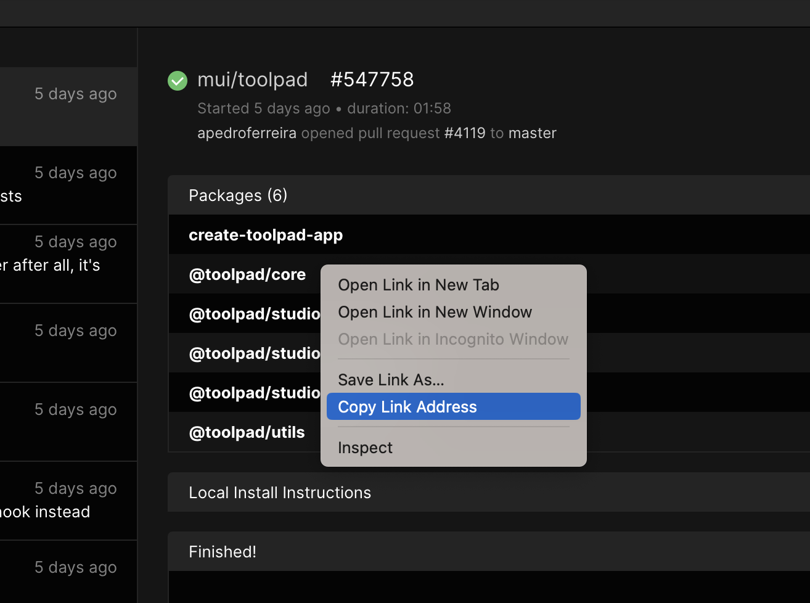

# Contributing

## Local development

If you would like to hack on MUI Toolpad Studio or want to run the latest version, you can follow these steps:

_If you're looking into contributing to the docs, follow the [instructions](#building-and-running-the-documentation) down below_

### Prerequisites

- git
- node.js

### Running apps inside the monorepo (recommended)

This will use the local version of Toolpad Studio as built in the monorepo. This is recommended when your app is in a folder inside of the monorepo. You may even decide to temporarily move your app into the monorepo.

1. Install dependencies:

   ```bash
   pnpm install
   ```

1. Run the build in watch mode

   ```bash
   pnpm dev
   ```

1. Run Toolpad Studio

   ```bash
   pnpm toolpad-studio dev test/integration/backend-basic/fixture/toolpad --dev
   ```

   **Note:** It's important to note the difference between `pnpm toolpad-studio dev` and the `--dev` parameter. The first instruction runs Toolpad Studio in dev mode. The `--dev` parameter is one for contributors only and runs the underlying next.js app that powers the editor in dev mode. The latter makes sure the development build of React is being used and the editor frontend application runs in watch mode.

If your application has dependencies other than `@toolpad/studio`, you have to temporarily add it to the workspace:

1. update `pnpm-workspace.yaml` (in the workspace root, not in your app), add your app folder to `workspaces.packages`. e.g. for `examples/qr-generator` which has a dependency on `qrcode` this would be:

   ```yaml
   packages:
     - 'packages/*'
     - 'docs'
     - 'test'
     - 'examples/qr-generator'
   ```

   You should also run `pnpm dev` as follows to avoid the dev scripts from kicking in

   ```bash
   pnpm dev --ignore qr-generator
   ```

1. Run

   ```bash
   pnpm install
   ```

1. Make sure to start the build in watch mode again and the run the app with

   ```bash
   pnpm toolpad-studio dev examples/qr-generator/toolpad --dev
   ```

### Linking Toolpad Studio in a folder on your system (advanced)

<details>
<summary>Expand instructions</summary>

In some cases you may want to link local Toolpad Studio app into a project on your laptop.

1. Install dependencies:

```bash
pnpm install
```

1. Run the build in watch mode

   ```bash
   pnpm dev
   ```

2. In another folder, start a Toolpad Studio project using:

   ```json
   {
     "name": "toolpad-local",
     "version": "1.0.0",
     "license": "MIT",
     "scripts": {
       "dev": "toolpad-studio dev --dev",
       "build": "toolpad-studio build --dev",
       "start": "toolpad-studio start --dev"
     },
     "dependencies": {
       "@toolpad/studio": "portal:<your-local-toolpad-monorepo>/packages/toolpad-studio"
     },
     "resolutions": {
       "@toolpad/studio": "portal:<your-local-toolpad-monorepo>/packages/toolpad-studio",
       "@toolpad/studio-runtime": "portal:<your-local-toolpad-monorepo>/packages/toolpad-studio-runtime",
       "@toolpad/studio-components": "portal:<your-local-toolpad-monorepo>/packages/toolpad-studio-components",
       "@toolpad/utils": "portal:<your-local-toolpad-monorepo>/packages/toolpad-utils"
     }
   }
   ```

   1. Replace `<your-local-toolpad-studio-monorepo>` with the path to the Toolpad Studio monorepo on your file system. Make sure to keep `portal:`.

   2. In order to use `portal:` dependencies, we will need to use yarn 2. So start by running

      ```bash
      yarn set version berry
      ```

      and add to the `.yarnrc.yml`:

      ```yaml
      nodeLinker: node-modules
      ```

   3. then run

      ```bash
      yarn install
      ```

3. Run start toolpad-studio in dev mode:

   ```bash
   yarn dev
   ```

</details>

## Running integration tests

The playwright tests can be run in one of two modes:

1. Build the production target, then run the integration tests in production mode:

   ```bash
   pnpm release:build
   pnpm test:integration --project chromium
   ```

2. Start Toolpad Studio in dev watchmode and run the integration tests in dev mode with the `TOOLPAD_NEXT_DEV` environment variable (slower)

   ```bash
   pnpm dev
   TOOLPAD_NEXT_DEV=1 pnpm test:integration --project chromium
   ```

Use the `--ui` flag to run the tests interactively.

## Building and running the documentation

1. If you haven't already, install the project dependencies using

   ```bash
   pnpm
   ```

1. To start the documentation application in dev mode run

   ```bash
   pnpm docs:dev
   ```

   If all goes well it should print

   ```bash
   ready - started server on 0.0.0.0:3003, url: http://localhost:3003
   ```

1. Open the docs application in the browser [http://localhost:3003/toolpad](http://localhost:3003/toolpad)

## Reviewing PRs

- Check out the PR branch locally with your tool of choice ([GitHub Docs](https://docs.github.com/en/pull-requests/collaborating-with-pull-requests/reviewing-changes-in-pull-requests/checking-out-pull-requests-locally?tool=cli))
- Run to build the project

  ```bash
  pnpm && pnpm release:build
  ```

- Run it on your project of choice

  ```bash
  pnpm toolpad-studio dev /path/to/my/toolpad/studio/project
  ```

## Using CodeSandbox CI

Each pull request is built on [CodeSandbox CI](https://codesandbox.io/docs/learn/sandboxes/ci). As a result of that we have a published Toolpad Studio package for ever pull request. To use the package from the pull request, take the following steps:

1. In the GitHub PR checks, locate the ci/codesandbox check and make sure it has successfully finished building. Click on "details" to open the CodeSandbox CI user interface.

2. In the codesandbox UI, on the right panel, locate and expand the "Packages (6)" section.

3. Right click the link named `@toolpad/studio` and copy the address

   

4. In your `package.json`, for the `@toolpad/studio` dependency, replace the version with aforementioned link. e.g.

   ```json
   "dependencies": {
      "@toolpad/studio": "https://pkg.csb.dev/mui/mui-toolpad/commit/<commit>/@toolpad/studio"
   }
   ```

5. Run

   ```bash
   pnpm --force
   ```

You'll now be able to explore your project with the Toolpad Studio version from the GitHub PR.

## Sending a pull request

Please have a look at our general [guidelines](https://github.com/mui/material-ui/blob/master/CONTRIBUTING.md#sending-a-pull-request) for sending pull requests.

## Release process

See [RELEASE.md](./RELEASE.md)
